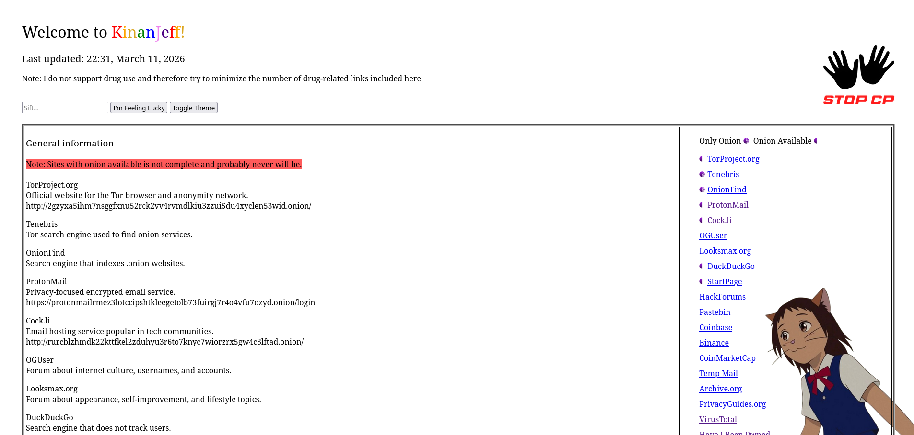

# KinanJeff Directory

A single-file HTML directory page.

This project is a lightweight webpage that can be opened directly in a browser without any dependencies.

## Features

- Single HTML file
- All images embedded with Base64
- Works fully offline
- No external libraries or frameworks required
- Search filter
- Designed to work in Tor Browser

## Preview



## Getting Started

### 1. Clone the repository

```bash
git clone https://github.com/peeboy7/KinanJeff-Directory.git
```

### 2. Open the file
```bash
# You can skip this step and just double-click the html file
cd kinanjeff
firefox KinanJeff.html  # or whatever browser you use
```
